# Integrating CodePay Payments

## Overview

CodePay terminals use the **ECR Hub** protocol (semi-integrated): your POS tells a
terminal "collect $X", the terminal runs the card transaction against CodePay's
processor and returns a result. The POS never touches card data.

**Core principle — do not invent the wire contract.** The single biggest failure
when integrating CodePay is reconstructing a "reasonable" REST API (`/v1/transactions`,
`amount_cents`, bearer tokens…). CodePay does **not** work that way. The real
protocol — `topic` / `biz_data` envelopes, `ecrhub.pay.order`, `response_code "000"`/`"0"`,
`trans_type` 1/2/3, decimal-string amounts — **cannot be guessed**. The facts you
need live in **`codepay-protocol-reference.md`** (next to this file) — but treat it
as a possibly-stale cache and **refresh from the live source first (Step 0)**, since
CodePay updates its docs.

## When to use

- Adding credit-card payments backed by a CodePay / Wisehub / PayCloud terminal
- Implementing sale, void, refund, tip, or transaction-query flows for CodePay
- Replacing an optimistic "paid by card" button with a real terminal authorization
- Any language/stack (Flutter/Dart, Kotlin, C#/.NET, TypeScript, Java…)

**Not for:** Stripe/Square/Adyen/PAX or other processors (different protocols).

## Step 0 — Refresh the protocol from the live source (do this FIRST)

`codepay-protocol-reference.md` is a **dated snapshot** that CAN go stale — CodePay
updates its docs and SDKs. The skill does NOT auto-fetch anything; YOU must refresh.
Before trusting any field name, enum, response code, Intent action, or endpoint for
code you will actually write:

1. **WebFetch the live docs** — start at https://developer.codepay.us/docs/guides/overview
   then the pages relevant to your topology (`api-structure`, `integrate-with-codepay-terminal`,
   `integrate-with-external-pos`, `api-secure`, `CloudAPI`). Links are in the reference.
2. **Check the official SDK** for your target platform (Android / Windows / Java cloud
   repos — links in the reference) for exact class/field/enum names.
3. **Reconcile**: if a live value differs from the snapshot, **the live value wins**.
   Note the diff to the user, and update `codepay-protocol-reference.md` so the cache
   stays current.

If you have no network access, say so explicitly and proceed on the snapshot — but
flag every wire detail as unverified. Never silently rely on the cache as if current.

## ⚠️ Required-credential gate — prompt for `app_id` FIRST (BLOCKING)

`app_id` is **mandatory** in every ECR Hub / Cloud message. Placeholder code compiles
and the app runs — but **every payment fails at runtime** until a *real* `app_id` is in
place (CodePay rejects it, e.g. `response_code 106` / `M009 Invalid application invoke`).
This is the #1 cause of *"the code is done but payments don't work."*

**Before writing any transport code, explicitly prompt the user and wait for the value:**

> "Before I wire this up — what is your CodePay `app_id`? (from your CodePay onboarding /
> Paypilot dashboard.) I need the **real** value or the terminal rejects every
> transaction. For the Cloud topology I also need `merchant_no` + the RSA2 keys."

Then bake that real value into the config. **Do not proceed past this gate without it.**

- **Never proceed on a `<your_app_id>` placeholder** or invent one.
- CodePay's `app_id` is **app-level (per-integrator)** — one value issued per POS app at
  onboarding, shared across all merchants. So it is normally **one configured constant**
  (keep it sandbox/production-switchable), **not** a per-merchant runtime input field.
  Asking the *developer* once for the real value (above) is still **required**; building
  a per-merchant input UI is not — unless the user's CodePay account actually issues
  `app_id` per merchant (rare; confirm first).

## Step 1 — Pick the integration topology (do this before any code)

```dot
digraph topology {
  rankdir=LR;
  "Where does the POS run?" [shape=diamond];
  "On the CodePay terminal itself?" [shape=diamond];
  "Can POS reach terminal on LAN/USB?" [shape=diamond];
  "A: On-terminal\n(Android Intent)" [shape=box];
  "B: External POS local\n(WebSocket/USB/Serial + ECR Hub)" [shape=box];
  "C: Cloud Gateway\n(RSA2 REST + MQTT)" [shape=box];
  "Where does the POS run?" -> "On the CodePay terminal itself?";
  "On the CodePay terminal itself?" -> "A: On-terminal\n(Android Intent)" [label="yes"];
  "On the CodePay terminal itself?" -> "Can POS reach terminal on LAN/USB?" [label="no"];
  "Can POS reach terminal on LAN/USB?" -> "B: External POS local\n(WebSocket/USB/Serial + ECR Hub)" [label="yes"];
  "Can POS reach terminal on LAN/USB?" -> "C: Cloud Gateway\n(RSA2 REST + MQTT)" [label="no"];
}
```

If more than one deployment is needed, design for all of them now (see Step 2). The
transaction semantics are identical across topologies — only transport differs.

## Step 2 — Adapt to the target codebase architecture

This skill is architecture-aware: **inspect the host project first, then map onto its
conventions.** Concretely:

1. **Find how the project already does device I/O** (e.g. a network receipt printer
   helper). A payment terminal is a *device integration*, not data CRUD — place it
   alongside that, and keep it OUT of any data/API/web-server layer. The resulting
   payment *record* still persists through the project's normal data path.
2. **Define one transport-agnostic interface** (`PaymentTerminal` with
   sale/void/refund/tipAdjust/query). UI and state layer depend only on it.
3. **One adapter per chosen topology** (A/B/C). All CodePay wire field names live
   ONLY inside adapters, so the rest of the app is insulated if the contract differs.
4. **Match the project's state/DI conventions** — its state container (Provider/Redux/
   MVVM/…), its settings store (where terminal IP, `app_id`, `merchant_no` go), its
   permission model, its localization, its receipt builder (add card line: brand,
   last4, `auth_code`, entry mode, APPROVED).
5. **Schema**: extend the payment record with `trans_no`, `auth_code`, `card_last4`,
   `card_brand`, `ref_no`, `pay_scenario`, `merchant_order_no`, `trans_status`. Store
   masked card data only. Follow the project's migration mechanism.

Give step-by-step guidance grounded in the *actual* files you read — never a generic
template dropped into a new folder.

## Step 3 — Implement the flow correctly

- **Sale** (`trans_type=1`): block on a "follow prompts on terminal" state; record the
  payment ONLY on a confirmed success code — **`"000"` (on-terminal Intent) or `"0"`
  (LAN WebSocket); accept both** or LAN reads an approved sale as a decline; decline →
  show error, record nothing.
- **Void** (`trans_type=2`, `orig_merchant_order_no`): reverse a same-day,
  pre-settlement card payment. **Refund** (`trans_type=3`): for settled orders.
- **Tip**: support all three models (terminal-screen / POS-entered / post-auth
  `ecrhub.pay.tip.adjustment`) and make the default configurable.
- **Recovery (non-negotiable):** unique `merchant_order_no` persisted *before* send;
  on timeout/lost response use `ecrhub.pay.query` to resolve true state; auto-void
  only genuinely-unknown sales, never declines. See reference for the two-step
  confirmation detail.
- **Amounts:** convert cents ↔ decimal string at the adapter boundary; unit-test it.

## Quick reference

| Thing | Value |
|---|---|
| Sale / void / refund | `ecrhub.pay.order` + `trans_type` `1` / `2` / `3` |
| Query (recovery) | `ecrhub.pay.query` by `merchant_order_no` |
| Close terminal screen | `ecrhub.pay.close` |
| Settlement | `ecrhub.pay.batch.close` |
| Tip adjust | `ecrhub.pay.tip.adjustment` |
| Success (ECR Hub) | `response_code` `"000"` (Intent) **or** `"0"` (LAN WebSocket) — accept both |
| Success (Cloud) | `code == "0"` |
| Amount on wire | decimal string `"2.15"`, NOT cents |
| On-terminal Intent | `com.codepay.transaction.call` |

Full field tables, response fields, SDK call shapes, RSA2 details, and official
doc/SDK links: **`codepay-protocol-reference.md`**.

## Common mistakes (observed in real attempts)

| Mistake | Reality |
|---|---|
| Reconstructing a plausible REST contract (`/v1/transactions`, `amount_cents`) | CodePay uses ECR Hub envelopes. A well-isolated *wrong* contract still doesn't work against a real terminal. Read the reference / SDK. |
| Putting integer cents on the wire | `order_amount` is a decimal string in major units. |
| Hand-rolling lookup-by-idempotency-key recovery | Use CodePay's native `request_id` + `ecrhub.pay.query` keyed by `merchant_order_no`. |
| Treating "no response" as "not charged" | It's UNKNOWN. Query before deciding; auto-void only unknown sales. |
| Querying (recovery) on every failed sale | Recover ONLY on a genuine UNKNOWN, never on real declines/cancels. See reference → *When to recover*. |
| A 2nd overlay for recovery — or dropping it early | Keep ONE "follow prompts" overlay across sale → recovery → final result. See reference → *One continuous overlay*. |
| `jsonDecode`-ing `biz_data` blindly | Cancel/others return an EMPTY `biz_data` → `jsonDecode("")` throws → false `unknown`. Guard empty/malformed → empty map. See reference. |
| Modeling only one deployment | If both on-terminal and external are needed, the transport must be pluggable from day one. |
| Only terminal-prompt tips | Bars/sit-down need post-auth `tip.adjustment`; cashiers need POS-entered. |
| Routing the terminal call through the data/web-server layer | It's device I/O — place it with other device integrations; persist the *result* normally. |
| Storing full PAN | Store masked last4 + brand only. Never PAN/track/CVV. |
| Topology-B WebSocket hangs forever on iOS/macOS | Terminal's non-standard `101` reason phrase; Apple's `URLSessionWebSocketTask` hangs silently. Hand-roll RFC-6455 over `NWConnection`. See reference. |
| LEAKING WebSocket connections (topology B) | Un-closed sockets (not connecting) slow the terminal. One socket per transaction, ALWAYS closed in `finally`. See reference → *Socket lifecycle*. |

## Red flags — STOP

- About to define a CodePay request/response shape from imagination → read
  `codepay-protocol-reference.md` and the official SDK first.
- Writing `amount` as an integer in the terminal request.
- "I'll just isolate the guessed contract and fix it later" → the contract is
  knowable now; get it right now.
- No `merchant_order_no` persisted before the send, or no query-based recovery path.
- Recording a card payment before a confirmed success code (`"000"` on Intent / `"0"` on LAN).
- Designing settings or writing transport code without first asking the user for a real
  `app_id` — a `<your_app_id>` placeholder is NOT enough; it can't transact.
